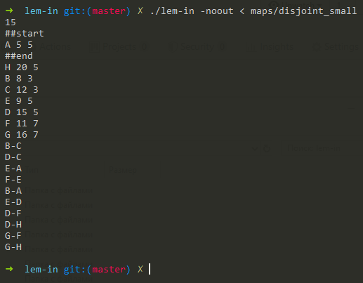
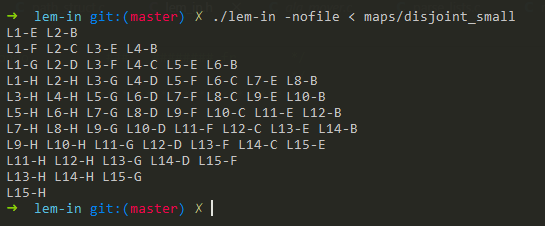

# Lem-In
The task is to send the ants through the graph so that they reach the finish line in the least number of moves, without collisions or traffic jams
### Installation
Lem-in requires:
+ [SDL](https://www.libsdl.org/) (for visualization porposes)
```sh
$ git clone --recurse-submodules https://github.com/sxhondo/lem-in.git && cd lem-in && make
```
This will create binary ./lem-in in the root-directory and binary ./visor_in/visor_in

### Run
```sh
$ ./lem-in < ./maps/<map>
```
## Explanation
+ The project reads a map defining a graph in the following format:
```
15 - number of ants
##start and ##end - start point and destination point
A 5 5 - example of the vertex with name 'A'
B-C  - example of the edge
```


+ Example of output
```
Every row corresponds to the one step of all ants in graph
L1 - corresponds to the ant and his id (e.g. '1')
-E - corresponds to the vertex where the ant located (e.g. vertex 'E')
```


### Summary
+ Uses BFS + Suurballe algorithms to find node-disjoint paths
+ Though it's not very fast implementation for the huge maps it's produces almost all of the existing paths
+ Credits for [my friend](https://github.com/TheWeaklessOne) for perfect visualisation.


